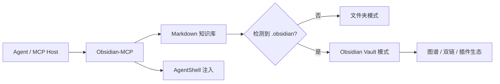

# Obsidian-MCP

一个面向“工作知识库”的 MCP 服务：既能把 Markdown 文件夹当作普通知识库来用，也能在检测到 Obsidian Vault 时自动进入图谱/双链模式。

它的定位不是重做 Obsidian，也不是做一个独立 UI，而是把“知识组织、分类、写入、检查、补全、注入 AgentShell 配置”这些事，整理成一套稳定的 MCP 工具和内置 skill。

## 这套东西解决什么

- 给 AI 和你自己共用同一套知识库
- 用中文目录管理工作产品、设计、AI 分享、Skill/教程、文章、参考资料
- 低置信度内容先进入收件箱，再由 agent 询问你放哪
- 如果装了 Obsidian，就直接获得图谱、双链、笔记联动
- 如果没装 Obsidian，也照样只是一个普通 Markdown 知识库，不会卡死

## 核心原则

- 一个知识库，优先一个 canonical note
- 人看和 AI 看可以共存
- 默认聊天只检索公司项目知识库，也就是 `01-项目`
- 用户自己的文章、草稿、个人资料默认不给 AI 检索，除非用户明确要求
- 项目知识才默认使用 `_AI索引.md` 和 `原始资料.md`；AI 分享、教程、文章默认单文档保存
- 不强依赖界面，`user_choice` 只是交互契约，弹窗由承载 MCP 的宿主软件决定
- Obsidian 只做可选的 vault 层，不重新实现它的核心能力

## 架构



## 快速开始

```bash
npm install
npm run build
npm start
```

默认会把当前目录当成知识库根目录。也可以显式指定：

- `OBSIDIAN_VAULT_PATH`
- `WORK_VAULT_PATH`

比如：

```bash
set OBSIDIAN_VAULT_PATH=D:\KnowledgeVault
npm start
```

## 知识库结构

默认不预先创建分类目录。目录按内容自然增长，不提前创建空文件夹。例如只有当用户提供对应资料时，才创建这些目录：

- `00-收件箱`：低置信度、待整理内容
- `01-项目`：工作 / 产品知识
- `02-设计`
- `03-AI分享`
- `04-技能教程`
- `05-文章`
- `06-参考资料`
- `08-日志`

模板不默认落盘，需要时直接生成到具体项目或目标文件里。

项目类知识按“三件套”组织，不为了填模板强行建空文件：

- `XXXX项目介绍.md`：给用户看的主体文档，AI 整理后的可读版；如果资料带图片，图片嵌入这里。
- `_AI索引.md`：给 AI 默认读取的高信号摘要，控制篇幅，链接到项目介绍和原始资料；默认不放图片。
- `原始资料.md`：备份用户原始输入、文件摘录和图片，便于追溯来源。

Obsidian 图谱以 `XXXX项目介绍.md` 为主体节点，项目介绍、AI索引、原始资料互相双链关联。其它文件只在内容确实变多时再创建。

非项目资料默认按单文档组织，不创建 `_AI索引.md` 或 `原始资料.md`：

- `03-AI分享/AI工具分享.md`
- `04-技能教程/Claude Code安装教程.md`
- `05-文章/文章标题.md`

这些内容主要给用户自己看，普通聊天和项目分析不默认检索；只有用户明确点名某篇文章、教程或要求搜索全库时才读取。

## Obsidian 模式怎么工作

`knowledge.detectObsidianVault` 会检查当前根目录是否包含 `.obsidian`，并读取 `plugins` 里的插件清单。

检测到 Vault 以后：

- 同一批 Markdown 文件可以直接在 Obsidian 中打开
- 双链和图谱会自动生效
- 这个 MCP 只负责知识组织和写入，不替代 Obsidian 的编辑器本体

没有检测到 Vault 也没关系：

- 仍然按普通文件夹方式工作
- 知识分类、搜索、写入、模板生成都能用
- 以后再把这个文件夹用 Obsidian 打开即可

## Obsidian 插件更新检测

如果你已经装了某个 Obsidian connector / community plugin，可以用：

- `knowledge.checkObsidianConnector`
- `knowledge.setObsidianConnectorSnapshot`

它会做这些事：

- 读取插件 `manifest.json`
- 记录版本快照
- 检查和上次快照是否变化
- 对比 `minAppVersion` 和当前 Obsidian 版本
- 如果你提供了 `latestVersionUrl`，还可以顺手看远端是否有新版本

这不是“官方 Obsidian MCP”的重写，而是对现成 connector 的版本和兼容性检查。

## 内置 skill

这里的 skill 是给 agent 用的工作流，不是 UI 功能。

一共 6 个，分别负责“建库、分流、写入、读取、归档、体检”：

- `kb.createProject`
  - 作用：创建项目知识库三件套
  - 包含：`XXXX项目介绍.md`、`_AI索引.md`、`原始资料.md`
  - 适合：新项目刚开始，需要建立用户可读文档、AI默认上下文和原始资料备份时

- `kb.classifyEntry`
  - 作用：判断一段内容应该放到哪里
  - 输出：分类结果、置信度、理由、建议目标路径、`user_choice`
  - 适合：agent 录入新内容、但还不确定放哪的时候

- `kb.writeStructured`
  - 作用：把内容按模板结构写入，并尽量保持层次统一
  - 重点：保留 canonical note，避免输出层次乱掉
  - 适合：产品说明、设计策略、AI 分享、教程文章等需要稳定结构的内容；非项目内容默认写成单文档

- `kb.loadContext`
  - 作用：加载项目或主题的高信号背景
  - 重点：项目先看 `_AI索引.md`，再按需读取项目介绍或原始资料；非项目主题只有用户点名时读取对应单文档
  - 适合：AI 回答“这个项目是干嘛的”“这个主题当前有什么背景”这类问题

- `kb.archiveInbox`
  - 作用：把 `00-收件箱` 里的临时内容归档到正式知识页
  - 支持：追加、移动、复制
  - 适合：先粗收集，再统一整理的工作流

- `kb.healthCheck`
  - 作用：检查知识库是否健康
  - 会查：缺失概览、过期文件、收件箱堆积、frontmatter 是否完整、connector 是否漂移
  - 适合：定期维护知识库，或者在内容堆积后做一次整理

这 6 个 skill 不是让你手工点按钮，而是给 agent 一套稳定的“先做什么、后做什么”的工作习惯。

## 主要 MCP 工具

### 1. 识别与规划

- `knowledge.skills`：查看内置 skill 列表
- `knowledge.outline`：查看推荐的知识库分区和模板
- `knowledge.detectObsidianVault`：识别是否为 Obsidian Vault
- `knowledge.recommendNoteStrategy`：判断适合共享笔记、拆分笔记还是先粗抓
- `knowledge.planNoteWrite`：在写入前输出完整方案

### 2. 分类与写入

- `knowledge.classifyEntry`：把内容路由到中文目录
- `knowledge.suggestTarget`：返回给宿主软件的 `user_choice`
- `knowledge.store`：创建或追加到一个知识文件
- `knowledge.writeSplitNote`：创建或追加“一主一辅”笔记，自动写入双链
- `knowledge.update`：追加或替换文件内容
- `knowledge.updateSection`：更新某个 H2 小节

### 3. 项目知识

- `knowledge.projects`：列出项目
- `knowledge.loadProject`：读取项目 AI索引
- `knowledge.createProject`：创建项目知识库骨架
- `knowledge.createIteration`：创建迭代记录
- `knowledge.compareProjects`：项目横向对比
- `knowledge.analyzeProject`：项目诊断

### 4. 读取与检索

- `knowledge.search`：默认只检索 `01-项目`；只有明确要求全库搜索时才使用 `scope: "all"`
- `knowledge.get`：读取单个文件
- `knowledge.sections`：列出 H2 目录
- `knowledge.getSection`：读取指定 H2

### 5. 收件箱与健康检查

- `knowledge.inbox`：查看收件箱待处理项
- `knowledge.archiveInbox`：归档收件箱内容
- `knowledge.healthCheck`：做知识库体检
- `knowledge.repairHealthIssue`：修复可安全修复的问题

### 6. AgentShell

- `agentshell.injectConfig`：把 AgentShell 配置写入 `CLAUDE.md` / `AGENTS.md`

## `planNoteWrite` 怎么理解

这个工具会把三件事一起算出来：

1. 当前是否是 Obsidian Vault
2. 内容应该归到哪一类
3. 该直接写、先问你，还是在明确需要时拆成主笔记 + AI 附录

常见结果：

- `direct_write`：可以直接落盘
- `ask_user`：需要你确认放哪
- `split_write`：建议拆分成一份主笔记和一份 AI 侧说明，主要用于项目资料或用户明确要求拆分的内容

当结果是 `split_write` 时，agent 应该先询问你是否确认拆分；确认后调用 `knowledge.writeSplitNote`。

## 拆分策略

默认不是做两套完整知识库，也不是所有资料都拆分。

推荐做法是：

1. 一份主笔记，给人和知识图谱用
2. 只有项目资料或明确需要 AI 复用时，才加一个 AI 附录，放 prompt、结构化总结、写作提示
3. 两者用链接互相指向，避免重复维护

`knowledge.writeSplitNote` 会自动完成这件事。比如主文档是 `产品定位.md`，默认会生成或追加：

- `产品定位.md`
- `产品定位_AI附录.md`

主文档里会写入 `[[产品定位_AI附录]]`，附录里会写入 `[[产品定位]]`。如果你用 Obsidian 打开同一个文件夹，图谱会自动连起来。

默认模式是 `append`，也就是不覆盖已有内容；只有明确传入 `mode: "replace"` 才会替换原文件。

项目资料优先整理进 `XXXX项目介绍.md`、`_AI索引.md`、`原始资料.md`；只有明确需要保存提示词、推导过程、AI 工作流或版本记录时，才创建 AI 附录。

AI 分享、技能教程、文章这类非项目资料默认只保留一份正文 Markdown，不创建 `_AI索引.md`、`原始资料.md` 或 AI 附录。它们不参与默认项目检索，除非用户明确点名文件或要求搜索全库。

## AgentShell 交互层

这里不内置弹窗 UI。

`user_choice` 只是一个交互输出格式，含义是：

- 如果宿主软件支持弹窗，就弹窗让用户选
- 如果宿主软件没有弹窗能力，就退回到聊天询问
- 这个 MCP 不强行造界面，也不依赖某个特定前端

## 开发

```bash
npm run typecheck
npm run build
```

## 备注

- 默认知识分类是中文命名
- 低置信度内容优先进入 `00-收件箱`
- 文件夹按已有内容创建，没有对应资料就不提前创建空目录
- 适合工作产品、设计知识、AI 分享、教程、文章、参考资料等场景
- 这套库既给 AI 看，也给你自己看
