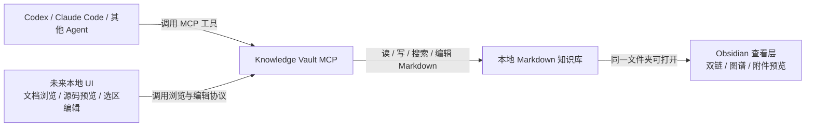
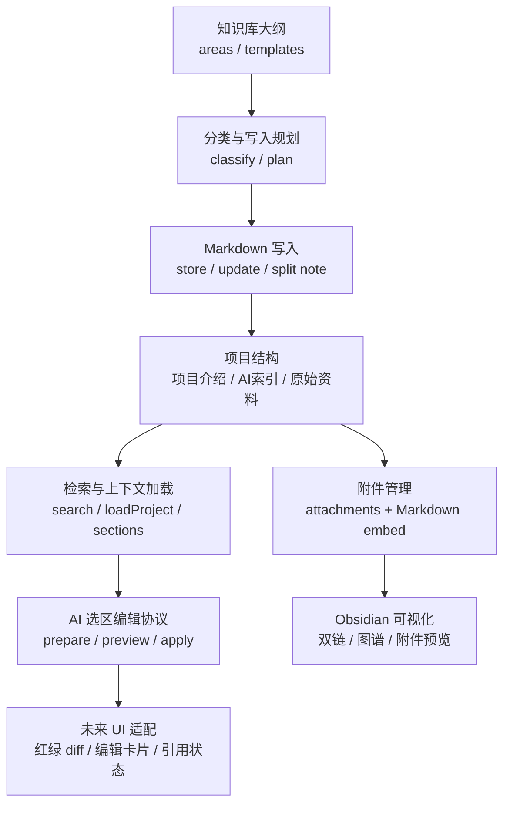
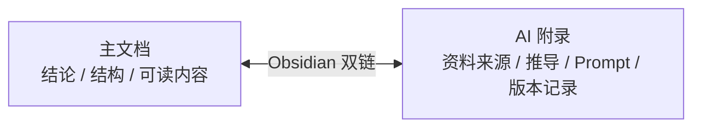
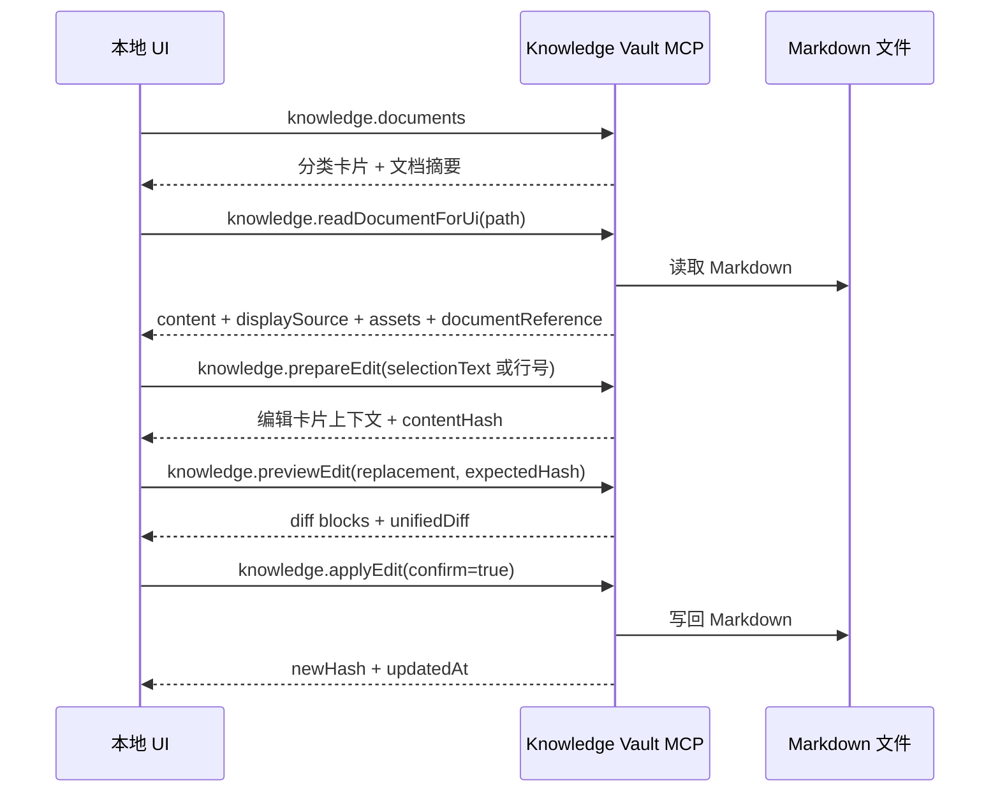
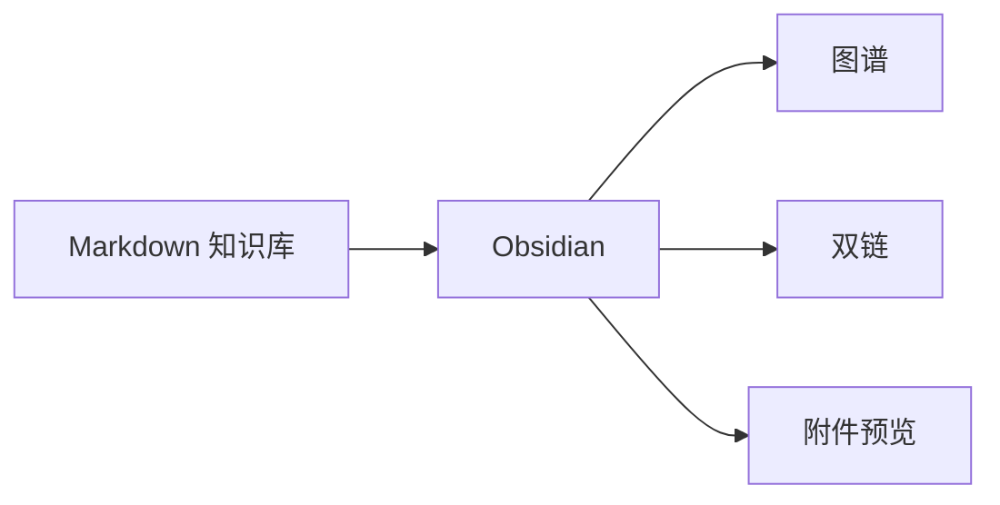

# Knowledge Vault MCP

当前版本：`0.2.0`

一个面向 AI agent 的本地 Markdown 工作知识库 MCP。它负责把零散资料整理成稳定的知识库结构，让 Codex、Claude Code 或其他支持 MCP 的 agent 可以安全地读取、分类、写入、编辑和维护 Markdown 文档。

Obsidian 在这里不是核心依赖，而是可选查看器：同一个 Markdown 文件夹可以用 Obsidian 打开，用来浏览双链、图谱和附件。

## 这是什么

| 定位 | 说明 |
| --- | --- |
| 本质 | Markdown 工作知识库 MCP |
| 服务对象 | AI agent + 用户共同维护的长期资料库 |
| 存储方式 | 本地文件夹 + Markdown |
| Obsidian 角色 | 可选阅读层，用来看双链、图谱、附件 |

## 解决什么

| 场景 | 过去的问题 | 现在的处理 |
| --- | --- | --- |
| 项目知识沉淀 | 背景、功能、定位、用户资料容易散落 | 用项目三件套固定结构 |
| AI 读取上下文 | 一次读太多，容易噪音过大 | 默认读取高信号项目索引，需要时再追溯 |
| 用户和 AI 共用资料 | 一份给人看，一份给 AI 看容易失控 | 一套主知识库，必要时才拆 AI 附录 |
| 资料写入 | agent 输出层次不齐 | 用分类、模板、写入策略约束 |
| 图片和 PDF | 附件位置混乱，不好追溯 | 统一放入项目 `attachments/`，继续嵌入 Markdown |
| 未来编辑 UI | UI 很难跨软件统一 | MCP 只提供编辑协议，UI 单独适配 |

## 架构



### 模块关系



## 核心原则

| 原则 | 说明 |
| --- | --- |
| 一套主知识库 | 用户和 AI 共用同一批 Markdown，不复制两套完整内容 |
| 项目资料结构化 | 工作/产品项目默认使用项目介绍、AI索引、原始资料三件套 |
| AI 默认读高信号内容 | AI 优先读项目索引，减少噪音；需要细节时再读正文和原始资料 |
| 非项目内容保持轻量 | 设计、AI分享、教程、文章默认单文档保存 |
| 附件仍在正文里看 | 图片、截图、PDF 统一管理，但阅读时仍嵌入 Markdown |
| UI 能力后置 | MCP 提供能力协议，不把界面写死在某个宿主软件里 |
| 写入要可控 | 修改文件的工具需要明确目标、预览或确认 |
| 触发词只做召回 | 触发词可以重复，用来找候选；归属不确定时让用户选择 |

## 知识库结构

| 目录 | 内容 |
| --- | --- |
| `00-收件箱` | 低置信度、待整理资料 |
| `01-项目` | 工作 / 产品 / 业务项目 |
| `02-设计` | 设计策略、规范、案例、方法 |
| `03-AI分享` | AI 工作流、提示词、案例复盘 |
| `04-技能教程` | skill、教程、工具使用手册 |
| `05-文章` | 文章草稿、观点、发布素材 |
| `06-参考资料` | 外部资料、报告、技术文档 |
| `08-日志` | 周报、月报、工作摘要 |

### 项目三件套

| 文件 | 用途 |
| --- | --- |
| `XXXX项目介绍.md` | 给用户和 AI 都能读的主体文档，放产品简介、功能、优势、场景、图片 |
| `AI索引.md` | 给 AI 优先读取的项目卡片，放高信号摘要、关键词、资料入口 |
| `原始资料.md` | 放原始输入、截图、PDF、资料摘录和来源备份 |

### 一主一辅

不是做两套知识库，而是：



只有内容很长、流程很多、prompt 很多、推导过程很重时，才拆 AI 附录。

## AI 上下文触发

AI 对话时不应该无脑读取整个知识库。推荐在可作为上下文入口的 Markdown，尤其是项目 `AI索引.md`，维护这些 frontmatter 字段：

```yaml
---
项目: XXX项目
类型: AI索引
标签: [AI索引, 小猪, 小羊]
别名: [小猪, 小羊羊]
触发词: [猪, 羊, 小]
读取优先级: high
---
```

判断规则：

| 信号 | 作用 |
| --- | --- |
| `项目` | 项目归属，权重最高 |
| `别名` | 项目的简称、型号、口语叫法 |
| `触发词` | 用来召回候选上下文，可以重复 |
| `标签` | 辅助分类和召回 |
| `类型` | `AI索引` 会优先作为项目入口 |
| `读取优先级` | 同分时优先读取 high |

触发词不是唯一键。多个项目都命中时，MCP 会返回候选和命中原因；分数接近时返回 `user_choice`，由 agent 让用户选择。

## 附件规则

项目附件统一放在：

```text
01-项目/项目名/attachments/
```

Markdown 中继续使用嵌入语法：

```markdown
![[attachments/homepage.png]]
```

默认规则：

| 类型 | 推荐位置 |
| --- | --- |
| 项目截图、产品图片 | `项目介绍.md` |
| 原始截图、资料 PDF、来源备份 | `原始资料.md` |
| 高信号摘要 | `AI索引.md` |

## 内置 Skills

| Skill | 用途 | 典型触发 |
| --- | --- | --- |
| `kb.createProject` | 创建项目知识库三件套 | 新建项目、创建产品知识库 |
| `kb.classifyEntry` | 判断内容应该放到哪个分类或文件 | 记录、保存到知识库、整理内容 |
| `kb.writeStructured` | 按固定结构写入 Markdown | 补充内容、更新条目 |
| `kb.loadContext` | 加载项目或主题上下文 | 关于某项目、读取背景 |
| `kb.routeContext` | 根据触发词、别名、标签规划 AI 应读上下文 | 触发词、项目背景、需要知识库上下文 |
| `kb.archiveInbox` | 整理收件箱内容 | 归档、清理待整理 |
| `kb.healthCheck` | 检查知识库结构和维护状态 | 检查知识库、发现问题 |

## 主要工具

### 浏览与读取

| 工具 | 作用 |
| --- | --- |
| `knowledge.outline` | 返回知识库分类大纲 |
| `knowledge.projects` | 列出项目 |
| `knowledge.documents` | 返回分类卡片和 Markdown 文档摘要 |
| `knowledge.loadProject` | 读取项目 AI 索引 |
| `knowledge.contextRules` | 列出带触发词、别名和优先级的上下文规则 |
| `knowledge.planContext` | 根据用户问题判断候选上下文；不确定时返回选择 |
| `knowledge.loadContextPlan` | 按规划读取 Markdown 上下文 |
| `knowledge.search` | 搜索知识库 |
| `knowledge.get` | 读取完整 Markdown 文件 |
| `knowledge.sections` | 列出文档 H2 目录 |
| `knowledge.getSection` | 读取指定 H2 章节 |
| `knowledge.readDocumentForUi` | 给未来 UI 返回文档内容、简化源码、附件和引用状态 |

### 写入与维护

| 工具 | 作用 |
| --- | --- |
| `knowledge.createProject` | 创建项目三件套 |
| `knowledge.createIteration` | 创建迭代记录 |
| `knowledge.planNoteWrite` | 写入前判断策略 |
| `knowledge.classifyEntry` | 分类并推荐目标路径 |
| `knowledge.store` | 创建或追加知识条目 |
| `knowledge.update` | 追加或替换文件 |
| `knowledge.updateSection` | 更新指定章节 |
| `knowledge.writeSplitNote` | 创建主文档 + AI 附录 |
| `knowledge.attachAsset` | 复制附件并插入 Markdown 嵌入链接 |
| `knowledge.inbox` | 列出收件箱 |
| `knowledge.archiveInbox` | 归档收件箱内容 |
| `knowledge.healthCheck` | 检查知识库问题 |
| `knowledge.repairHealthIssue` | 修复单个问题 |

### AI 选区编辑

| 工具 | 作用 | 是否写文件 |
| --- | --- | --- |
| `knowledge.prepareEdit` | 把选中文案或行号范围解析成编辑上下文 | 否 |
| `knowledge.previewEdit` | 返回临时红绿 diff 数据 | 否 |
| `knowledge.applyEdit` | 用户确认后写回 Markdown | 是 |

## 未来 UI 可以接哪些接口



| UI 功能 | 推荐接口 |
| --- | --- |
| 分类首页 | `knowledge.documents` |
| 文档列表 | `knowledge.documents` |
| 打开文档 | `knowledge.readDocumentForUi` |
| 源码 / 预览 Tab | `content` + `displaySource` |
| 当前文档引用状态 | `documentReference` |
| 图片源码精简显示 | `displaySource` |
| 复制 Markdown | `content` |
| 下载 Markdown | `content` + `path` |
| 打开本地位置 | `absolutePath`，由 UI 调系统能力 |
| 选中文字编辑 | `knowledge.prepareEdit(selectionText)` |
| 行号范围编辑 | `knowledge.prepareEdit(startLine,endLine)` |
| 红绿 diff 预览 | `knowledge.previewEdit` |
| 确认写回 | `knowledge.applyEdit(confirm=true)` |
| 防止旧内容误写 | `expectedHash` |

红删绿增、高亮卡片、悬浮编辑按钮、源码/预览切换，这些属于 UI 层，不属于 MCP 本身。

## Obsidian 的角色



这个项目不是 Obsidian 插件，也不是专门的 Obsidian MCP 连接器。更准确的说法是：

> 一个兼容 Obsidian 查看体验的 Markdown 工作知识库 MCP。

也就是：没有 Obsidian 也能用；有 Obsidian 时更方便查看。

## 使用

```bash
npm install
npm run build
npm start
```

默认读取当前目录。也可以指定：

| 环境变量 | 说明 |
| --- | --- |
| `OBSIDIAN_VAULT_PATH` | 知识库根目录 |
| `WORK_VAULT_PATH` | 知识库根目录备用变量 |

## 开发验证

```bash
npm run typecheck
npm run build
```
